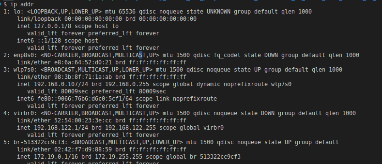
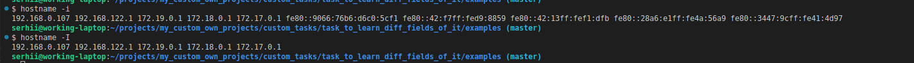

### get a list of public ip adresses in the network

```bash
ifconfig
# or
ip addr
# or
ip a
```



### get public ip

```sh
$ curl ifconfig.me
37.55.68.104
```

### hostname of the pc




### dns server 

```sh
$ cat /etc/resolv.conf
# Dynamic resolv.conf(5) file for glibc resolver(3) generated by resolvconf(8)
#     DO NOT EDIT THIS FILE BY HAND -- YOUR CHANGES WILL BE OVERWRITTEN
# 127.0.0.53 is the systemd-resolved stub resolver.
# run "systemd-resolve --status" to see details about the actual nameservers.

nameserver 127.0.0.53
search www.tendawifi.com
```


dns server of the google

```sh
$ dig google.com

; <<>> DiG 9.18.12-0ubuntu0.22.04.1-Ubuntu <<>> google.com
;; global options: +cmd
;; Got answer:
;; ->>HEADER<<- opcode: QUERY, status: NOERROR, id: 55367
;; flags: qr rd ra; QUERY: 1, ANSWER: 1, AUTHORITY: 0, ADDITIONAL: 1

;; OPT PSEUDOSECTION:
; EDNS: version: 0, flags:; udp: 65494
;; QUESTION SECTION:
;google.com.                    IN      A

;; ANSWER SECTION:
google.com.             7       IN      A       142.250.203.206

;; Query time: 0 msec
;; SERVER: 127.0.0.53#53(127.0.0.53) (UDP)
;; WHEN: Fri Apr 28 13:15:12 EEST 2023
;; MSG SIZE  rcvd: 55

```

### Default gateway
v1

```sh
$ route -n
Kernel IP routing table
Destination     Gateway         Genmask         Flags Metric Ref    Use Iface
0.0.0.0         192.168.0.1     0.0.0.0         UG    600    0        0 wlp7s0
169.254.0.0     0.0.0.0         255.255.0.0     U     1000   0        0 virbr0
172.17.0.0      0.0.0.0         255.255.0.0     U     0      0        0 docker0
172.18.0.0      0.0.0.0         255.255.0.0     U     0      0        0 br-6aa776773333
172.19.0.0      0.0.0.0         255.255.0.0     U     0      0        0 br-513322cc9cf3
192.168.0.0     0.0.0.0         255.255.255.0   U     600    0        0 wlp7s0
192.168.122.0   0.0.0.0         255.255.255.0   U     0      0        0 virbr0
```
v2

```sh
 ip route show
default via 192.168.0.1 dev wlp7s0 proto dhcp metric 600 
169.254.0.0/16 dev virbr0 scope link metric 1000 linkdown 
172.17.0.0/16 dev docker0 proto kernel scope link src 172.17.0.1 linkdown 
172.18.0.0/16 dev br-6aa776773333 proto kernel scope link src 172.18.0.1 
172.19.0.0/16 dev br-513322cc9cf3 proto kernel scope link src 172.19.0.1 
192.168.0.0/24 dev wlp7s0 proto kernel scope link src 192.168.0.107 metric 600 
192.168.122.0/24 dev virbr0 proto kernel scope link src 192.168.122.1 linkdown 
```
### nslookup

nslookup is a command-line tool to discover the IP address or DNS record of a specific domain name. It also allows for reverse DNS lookup, letting you find the domain attached to an IP address. To use the tool, enter “nslookup” into the Command Prompt or Terminal.

query A of google

```sh
$ nslookup -query=A dns.google
Server:         127.0.0.53
Address:        127.0.0.53#53

Non-authoritative answer:
Name:   dns.google
Address: 8.8.4.4
Name:   dns.google
Address: 8.8.8.8
```

query AAAA of google

```sh
$ nslookup -query=AAAA dns.google
Server:         127.0.0.53
Address:        127.0.0.53#53

Non-authoritative answer:
Name:   dns.google
Address: 2001:4860:4860::8888
Name:   dns.google
Address: 2001:4860:4860::8844
```

ping server with ipv4 and ipv6

```sh
$ ping 8.8.8.8
PING 8.8.8.8 (8.8.8.8) 56(84) bytes of data.
64 bytes from 8.8.8.8: icmp_seq=1 ttl=116 time=31.6 ms
64 bytes from 8.8.8.8: icmp_seq=2 ttl=116 time=31.1 ms
64 bytes from 8.8.8.8: icmp_seq=3 ttl=116 time=30.9 ms
64 bytes from 8.8.8.8: icmp_seq=4 ttl=116 time=30.2 ms
64 bytes from 8.8.8.8: icmp_seq=5 ttl=116 time=29.8 ms
64 bytes from 8.8.8.8: icmp_seq=6 ttl=116 time=30.0 ms
64 bytes from 8.8.8.8: icmp_seq=7 ttl=116 time=30.1 ms
64 bytes from 8.8.8.8: icmp_seq=8 ttl=116 time=30.3 ms
64 bytes from 8.8.8.8: icmp_seq=9 ttl=116 time=33.9 ms
```

scan for open ports

```sh
$ hostname -I
192.168.0.107 192.168.122.1 172.19.0.1 172.18.0.1 172.17.0.1 
```
v1

```sh
$ nmap -p 1-65535  192.168.0.107
Starting Nmap 7.93 ( https://nmap.org ) at 2023-04-28 14:00 EEST
Nmap scan report for working-laptop (192.168.0.107)
Host is up (0.00011s latency).
Not shown: 65530 closed tcp ports (conn-refused)
PORT      STATE SERVICE
22/tcp    open  ssh
80/tcp    open  http
5432/tcp  open  postgresql
5435/tcp  open  sceanics
34809/tcp open  unknown

Nmap done: 1 IP address (1 host up) scanned in 2.50 seconds
```

v2

```sh
$ nmap -p 1-65535  172.19.0.1
Starting Nmap 7.93 ( https://nmap.org ) at 2023-04-28 14:00 EEST
Nmap scan report for working-laptop (172.19.0.1)
Host is up (0.00012s latency).
Not shown: 65530 closed tcp ports (conn-refused)
PORT      STATE SERVICE
22/tcp    open  ssh
80/tcp    open  http
5432/tcp  open  postgresql
5435/tcp  open  sceanics
34809/tcp open  unknown

Nmap done: 1 IP address (1 host up) scanned in 1.61 seconds
```

### Check availibility of google

```sh
curl -I https://www.google.com
HTTP/2 200 
content-type: text/html; charset=ISO-8859-1
content-security-policy-report-only: object-src 'none';base-uri 'self';script-src 'nonce-ARVjWRN3ZD5jqs9GaFtaIw' 'strict-dynamic' 'report-sample' 'unsafe-eval' 'unsafe-inline' https: http:;report-uri https://csp.withgoogle.com/csp/gws/other-hp
p3p: CP="This is not a P3P policy! See g.co/p3phelp for more info."
date: Fri, 28 Apr 2023 11:04:50 GMT
server: gws
x-xss-protection: 0
x-frame-options: SAMEORIGIN
expires: Fri, 28 Apr 2023 11:04:50 GMT
cache-control: private
set-cookie: 1P_JAR=2023-04-28-11; expires=Sun, 28-May-2023 11:04:50 GMT; path=/; domain=.google.com; Secure
set-cookie: AEC=AUEFqZeo4z9sWPbqvQqudv5vGdMCaV4QNl3vdolEioyySHoV7nVUeMzKSQ; expires=Wed, 25-Oct-2023 11:04:50 GMT; path=/; domain=.google.com; Secure; HttpOnly; SameSite=lax
set-cookie: NID=511=Z-vpsWeWhrm7W2oamG5TcKaBQT5327bTI8eEymJzEy-8H7OFXlqaJtqsZXJf8SApQ9D_oR0bHiw6nXzB0N82w1st1pjkm3TdoFMmhlyPiVavCx_P-Gqjr9qLJwYpeAzuEXQAmL363eoplsQM-CBf3_z60O-I8fcgw05IWq1Ga7k; expires=Sat, 28-Oct-2023 11:04:50 GMT; path=/; domain=.google.com; HttpOnly
alt-svc: h3=":443"; ma=2592000,h3-29=":443"; ma=2592000

```

get final redirect with curl

```sh
curl -Ls -o /dev/null -w %{url_effective} http://google.com
http://www.google.com/
```
