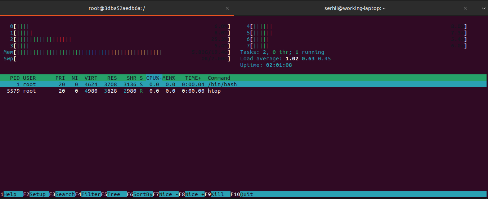

### getting a list of docker images

```sh
$ docker images
REPOSITORY                    TAG            IMAGE ID       CREATED         SIZE
snitch-web-api-web-api        latest         007f038a9a31   2 weeks ago     1.26GB
nestjs-project-frontend_app   latest         04c079761a6a   3 weeks ago     1.84GB
nestjs-project-backend_app    latest         861769d172dc   3 weeks ago     1.49GB
nfts-app-client_app           latest         507bda71e0c5   3 weeks ago     2.01GB
<none>                        <none>         37ef6dbc994e   3 weeks ago     1.78GB
<none>                        <none>         fe3205de9300   3 weeks ago     2.05GB
<none>                        <none>         b4e227d211ba   3 weeks ago     2.04GB
```

### pulling and running ubuntu

```sh
serhii@working-laptop:~
$ docker pull ubuntu
Using default tag: latest
latest: Pulling from library/ubuntu
2ab09b027e7f: Already exists
Digest: sha256:67211c14fa74f070d27cc59d69a7fa9aeff8e28ea118ef3babc295a0428a6d21
Status: Downloaded newer image for ubuntu:latest
docker.io/library/ubuntu:latest
serhii@working-laptop:~
$ docker run -it ubuntu /bin/bash
root@3dba52aedb6a:/#
```

### installing htop

```sh
root@3dba52aedb6a:/# apt-get install htop
Reading package lists... Done
Building dependency tree... Done
```

### htop inside docker


