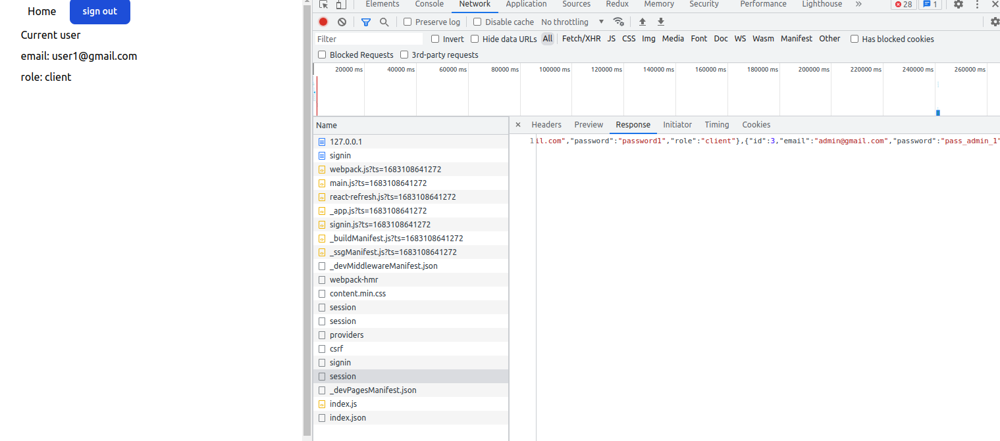

## Getting Started

First, run the development server:

```bash
npm run dev
# or
yarn dev
# or
pnpm dev
```

### Steps to haсk this app

1. run the database and create appropriate table
   user:
   id, email, password, role

2. run the back-end

3. Sign in with
   email:<br/>
   _user1@gmail.com_ <br />
   and password:<br />
   _password1'; select * from users; select * from users where email != '_ <br/>
   quotes included
4. inspect session request in the network tab <br />


